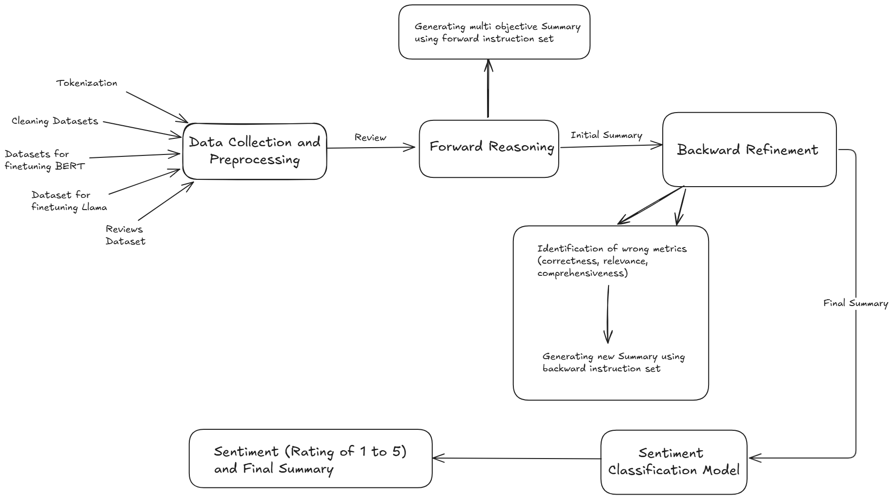

# Product Review Summarization and Classification 🚀

**Product Review Summarization and Classification** leverages the cutting-edge **FB-Thinker framework** for effective summarization and **BERT-based classification models** for categorizing product reviews. This project addresses key challenges such as factual accuracy, aspect coverage, and content relevance to help consumers make informed purchasing decisions. 🛍️

---

## ✨ Features  
- **Summarization** 📝: Enhances large language models (LLMs) using **Multi-Objective Forward Reasoning** and **Multi-Reward Backward Refinement**, inspired by [Sun et al., 2024](https://openreview.net/forum?id=06VYW37Shd).  
- **Classification** 📊: Utilizes fine-tuned BERT models for accurate product review categorization.  
- **Datasets** 📚: Curated datasets, including **Product-CSum**, and additional datasets using the Gemini framework, for training and evaluation.  

---

## 📁 Datasets  
- **Product-CSum**: Reviews sourced from online forums and annotated using GPT-assisted techniques.  
- **Gemini Framework Datasets**: Used to fine-tune LongFormer models as reward models and the BERT model as a classifier.

### Dataset Structure  
- **Input**: Raw product reviews.  
- **Output**: Summaries and classification labels.

---

## ⚙️ Setup  

### 1. Clone the Repository  
```bash
git clone https://github.com/devAmaresh/User-review-summarization-sem5.git  
```

### 2. Download Models  
- **Summarization**: Download the Llama model using the script `downloading_llama.py`.  
- **Backward Refinement**: Download the LongFormer models for backward refinement using the `train_longformer.ipynb` notebook.  
- **Classification**: Download the BERT model for classification from [Hugging Face](https://huggingface.co).  

### 3. Install Dependencies  
```bash
pip install -r requirements.txt
```

### 4. Generating Summaries  
To generate summaries, run the `app.py` script:  
```bash
streamlit run app.py
```
---

## 📊 Flowchart of the Process



---

## 🗂️ Files and Directories  
- `app.py` 🎯: Main application script.  
- `generate_summary.py` ✍️: Functions to generate summaries.  
- `initial_summary.py` ✨: Functions to generate initial summaries.  
- `eval.py` ✅: Script to evaluate summaries.  
- `evaluation.py` 📏: Functions to evaluate summaries.  
- `score.py` 🏆: Calculates BLEU, ROUGE, METEOR, and BERTScore.  
- `sentiment.py` 😊: Functions for sentiment analysis.  
- `templates.py` 🛠️: Functions to generate templates for text generation.  
- `using_reward_models.py` 🔄: Functions to use reward models for text refinement.  
- `downloading_llama.py` ⬇️: Script to download and save the LLM model.  
- `train_longformer.ipynb` 📓: Jupyter notebook to fine-tune and save LongFormer models.  
- `language_translate/` 🌐: Code for dataset translation from Chinese to English.  
- `template_files/` 📂: Contains template files for text generation.

---

## 📜 References

### Papers Referenced
- Sun, L., Wang, S., Han, M., Lai, R., Zhang, X., Huang, X., & Wei, Z. (2023). **Multi-Objective Forward Reasoning and Multi-Reward Backward Refinement for Product Review Summarization**. Fudan University, Huawei Poisson Lab. [OpenReview](https://openreview.net/forum?id=06VYW37Shd).  
- **BibTeX**:  
  ```bibtex
  @inproceedings{sun-etal-2024-multi,
    title = "Multi-Objective Forward Reasoning and Multi-Reward Backward Refinement for Product Review Summarization",
    author = "Sun, Libo  and
      Wang, Siyuan  and
      Han, Meng  and
      Lai, Ruofei  and
      Zhang, Xinyu  and
      Huang, Xuanjing  and
      Wei, Zhongyu",
    editor = "Calzolari, Nicoletta  and
      Kan, Min-Yen  and
      Hoste, Veronique  and
      Lenci, Alessandro  and
      Sakti, Sakriani  and
      Xue, Nianwen",
    booktitle = "Proceedings of the 2024 Joint International Conference on Computational Linguistics, Language Resources and Evaluation (LREC-COLING 2024)",
    month = may,
    year = "2024",
    address = "Torino, Italia",
    publisher = "ELRA and ICCL",
    url = "https://aclanthology.org/2024.lrec-main.1043/",
    pages = "11944--11955",
    abstract = "Product review summarization aims to generate a concise summary based on product reviews to facilitate purchasing decisions. This intricate task gives rise to three challenges in existing work: factual accuracy, aspect comprehensiveness, and content relevance. In this paper, we first propose an FB-Thinker framework to improve the summarization ability of LLMs with multi-objective forward reasoning and multi-reward backward refinement. To enable LLM with these dual capabilities, we present two Chinese product review summarization datasets, Product-CSum and Product-CSum-Cross, for both instruction-tuning and cross-domain evaluation. Specifically, these datasets are collected via GPT-assisted manual annotations from an online forum and public datasets. We further design an evaluation mechanism Product-Eval, integrating both automatic and human evaluation across multiple dimensions for product summarization. Experimental results show the competitiveness and generalizability of our proposed framework in the product review summarization tasks."
  }
  
